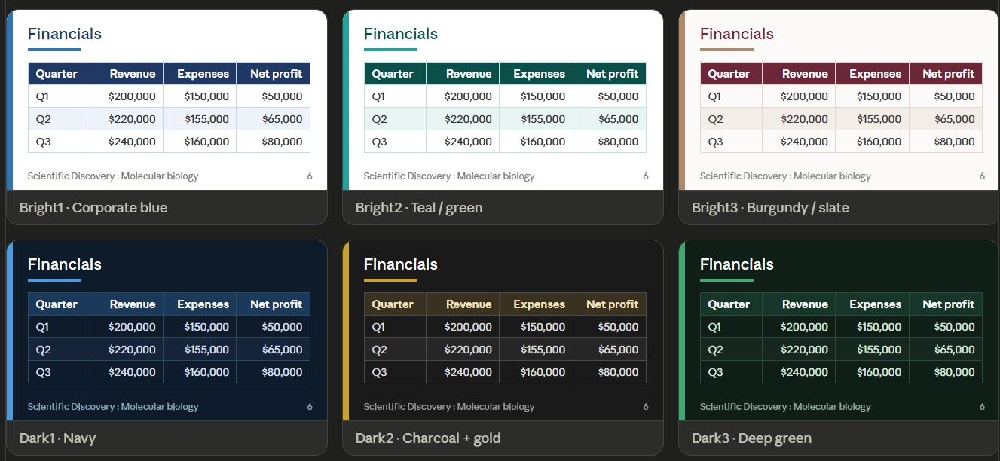

# Auto Presentation Builder

**Version:** 1.0.0 &nbsp;·&nbsp; **Date:** 2026-07-06

Automatically generate a **16:9** PowerPoint (`.pptx`) from a `.json` content file.

## Files in this folder
| File | Purpose |
|------|---------|
| `auto_deck.py` | All core code (load JSON → build the `.pptx`) |
| `auto_deck_demo.ipynb` | Notebook to run the builder |
| `example_input.json` | A valid example content file (recommended to follow) |
| `sample_input.json` | The original example (had several format mistakes — the loader repairs them) |

## Usage
```bash
pip install python-pptx pillow requests
python auto_deck.py example_input.json output.pptx
```
Or in Python / a notebook:
```python
from auto_deck import build_presentation
build_presentation("example_input.json", "output.pptx")
```

## JSON file structure
A file contains **one** `HEADER` and **any number of** `PAGE` entries (written one after another).

### HEADER
```json
"HEADER": {
    "LOGO_LINK": "url or path to the logo",   // omit = no logo
    "THEME": "Bright1",                         // see theme list below
    "FONT_HEADINGS": "Calibri Light",
    "FONT_BODY": "Calibri",
    "PAGE_NUMBER": true
}
```
If a value is missing, defaults are used: `THEME=Bright1`, fonts `Calibri Light` / `Calibri`, `PAGE_NUMBER=true`.

**Themes (6 total, all formal)** — 3 light / 3 dark
`Bright1` corporate blue · `Bright2` teal/green · `Bright3` burgundy/slate
`Dark1` navy · `Dark2` charcoal + gold · `Dark3` deep green



### PAGE — supported `PAGE_LAYOUT` values
| Layout | Used for | Content (`PAGE_CONTENT`) |
|--------|----------|---------------------------|
| `Title` | First / title page | None — only `PAGE_TITLE`, `PAGE_SUBTITLE` |
| `Section` | Section divider (color a step below Title) | None — only `PAGE_TITLE`, `PAGE_SUBTITLE` |
| `Single_Content` | One content block | 1 object |
| `Two_Content` | 2 columns (50/50) | 2 objects |
| `Tree_Content` | 3 columns (33%) | 3 objects |
| `Four_Content` | 4 columns (25%) | 4 objects |
| `Picture_Content` | Image-focused | `PICTURE` (+ optional `TEXT`) |
| `Table_Content` | Table-focused | `TABLE` (+ optional `TEXT`) |

> If you provide more objects than a layout supports, the extra ones are not shown.

### Content types inside `PAGE_CONTENT`
- `BULLET` — an array of strings → rendered as bullet points
- `TEXT` — plain text
- `PICTURE` — an image path or URL (SVG is not supported and will be skipped)
- `TABLE` — a **2-D array**; the first row is the header, e.g.
  ```json
  "TABLE": [["Quarter","Revenue"], ["Q1","$200,000"]]
  ```

### Two ways to write multi-column content
Both forms are accepted:
```json
// Array form (recommended — standard JSON)
"PAGE_CONTENT": [ {"TEXT":"left"}, {"BULLET":["right"]} ]

// Duplicate-key form (matches the original design — the loader handles it)
"PAGE_CONTENT": { "TEXT":"left", "TEXT":"right" }
```

## Page elements
- **Logo**: top-left on every page (when `LOGO_LINK` is set)
- **Page number**: bottom-right (on every page except the Title page)
- **Deck title**: bottom-left = `PAGE_TITLE : PAGE_SUBTITLE` of the first `Title` page

## Tolerance for malformed input
The loader automatically repairs common mistakes:
`//` and `/* */` comments, Python literals (`True/False/None`), missing commas,
trailing commas, a missing outer `{ }`, repeated `"PAGE"` keys, and exotic
whitespace (e.g. non-breaking spaces).

⚠️ Limitation: `TABLE` **must** be a 2-D array. Writing it as a set like `{"a","b"}`
makes the column count ambiguous, so that table is skipped.
Any missing value is always filled with a default (no error).

## License
Copyright (C) 2026 Phakin Wongveerapaiboon &lt;kim@pioms.org&gt;

This project is licensed under the **GNU General Public License v3.0** (GPL-3.0).
You may use, modify, and redistribute it, but any distributed derivative work
must also be released as open source under the same GPL-3.0 license.
See the [LICENSE](LICENSE) file for the full text.
